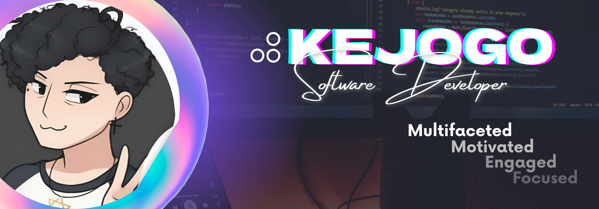

  
  
  
  
  
  

<h1 align="center">

  
   
  ¡Kevin al habla! ¡Nice to meet you!
  
</h1>

## 💫 Hi there
Excited and interested in everything I realize I have yet to learn. Mostly strong in Backend with good Frontend skills.  
👂 My full name is *Kevin Johan González Velandia* 🔭 I’m currently training on [🧑‍🚀Campuslands](https://www.linkedin.com/company/campuslands/) 👯 I’m looking to collaborate on backend related projects 🌱 I’m currently learning SQL | Java | SpringBoot | Scrum | Soft Skills 📫 Contact me ➜ [kejogo.dev@outlook](mailto:kejogo.dev@outlook) 👨‍💻 All of my projects are available at [my portfolio](https://kevinjgv.github.io/KevinJGV/) 💬 Ask me about places to visit in my city ❤️ I love videogames | learn spiritual things/knowledge ⚡ Fun fact: I think i have 4 nipples 🫣🌰

## 💻 Tech Stack
                     

## 📊 GitHub Stats
<section align="center">

    
    

</section>

## 🔝 Top Contributed Repo
<section align="center">

  

</section>

## ✍️ Random Dev Quote
<section align="center">

  

</section>

## 💰 You can help me by Donating

<section align="center">

   

</section>

 

