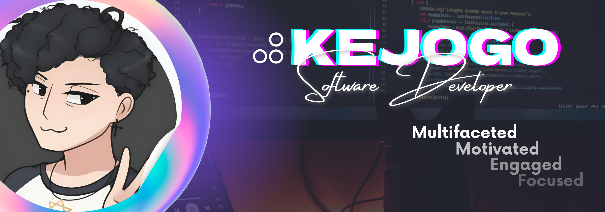
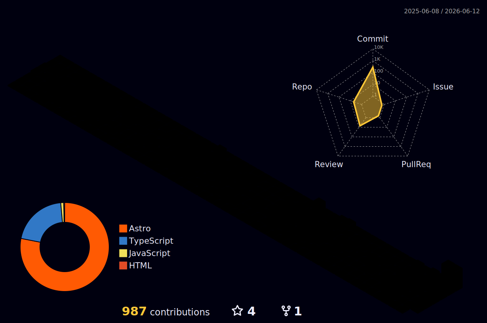

  
  
  
  
  

<h1 align="center">

 
¡Kevin al habla! ¡Nice to meet you!

</h1>

## 💫 Hi there

Excited and interested in everything I realize I have yet to learn. Solid across the FullStack with a soft spot for architecture and AI integration.  
👂 My full name is _Kevin Johan González Velandia_ 🔭 Wrapping up my FullStack Developer / Implementation Lead role at [Clonai](https://www.linkedin.com/company/clonaico/) 👯 I’m looking to collaborate on product-focused projects, especially anything mixing SaaS + AI integration 🌱 I’m currently learning agentic patterns, advanced TypeScript, and team leadership 📫 Contact me ➜ [vin.devsito@gmail.com](mailto:vin.devsito@gmail.com)<!--  👨‍💻 All of my projects are available at [my portfolio](https://www.vindevsito.dev/) -->

🫣 <b>Chismes</b> — stuff nobody asked but I'll tell you anyway

 

💬 Ask me about places to visit in my city — I'll happily talk your ear off 
🎮 I love videogames (go ahead, ask me what I'm grinding right now) 
🔮 Into spiritual things & knowledge — the down-the-rabbit-hole kind 
⚡ Fun fact: I'm fairly convinced I have 4 nipples 🫣🌰

### 🎧 What am I listening to now?

## 💻 Tech Stack

                                   

## 📊 GitHub Stats

<h2 align="center">

  
  

</h2>

## ⌛ Coding Time

<h2 align="center">

</h2>

## 🏆 Trophies

<h2 align="center">

</h2>

## 📈 Activity Graph

<h2 align="center">

</h2>

## 🧊 3D Contributions

<h2 align="center">

</h2>

## 🔝 Top Contributed Repo

<h2 align="center">

</h2>

## ✍️ Random Dev Quote

<h2 align="center">

</h2>

## 💰 You can help me by Donating

<h2 align="center">

</h2>
<h2 align="center">
 
</h2>
