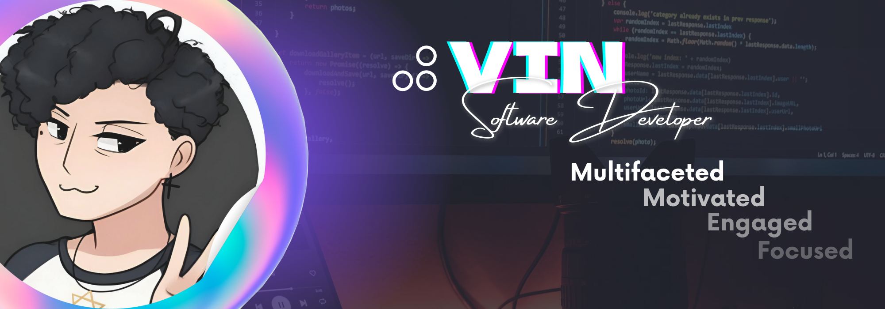

  
  
  
  
  
  

<h1 align="center">

  
   
  ¡Kevin al habla! ¡Nice to meet you!
  
</h1>

## 💫 Hi there
Excited and interested in everything I realize I have yet to learn. Mostly strong in Backend with good Frontend skills.  
👂 My full name is *Kevin Johan González Velandia* 🔭 I’m currently training on [🧑â€ğŸš€Campuslands](https://www.linkedin.com/company/campuslands/) 👯 I’m looking to collaborate on backend related projects 🌱 I’m currently learning Java | PostgreSQL | SpringBoot | Soft Skills 📫 Contact me ✠[vin-dev@outlook.com](mailto:vin-dev@outlook.com) 👨â€ğŸ’» All of my projects are available at [my portfolio](https://kevinjgv.github.io/KevinJGV/) 💬 Ask me about places to visit in my city â¤ï¸ I love videogames | learn spiritual things/knowledge âš¡ Fun fact: I believe i have 4 nipples 🫣🌰

<!-- ### 🎧 What am i listening now?
 -->

## 💻 Tech Stack
                    

## 📊 GitHub Stats
<h2 align="center">

    
    
  
</h2>

## 🔝 Top Contributed Repo
<h2 align="center">

  
</h2>

## ✍️ Random Dev Quote
<h2 align="center">

  
</h2>

## 💰 You can help me by Donating

<h2 align="center">

   
</h2>
<h2 align="center">
 
</h2>
